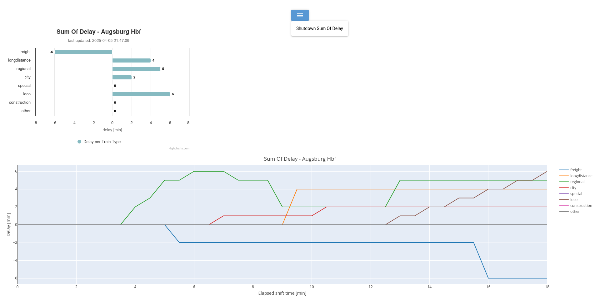

# Sum Of Delay - Stellwerksim Plugin
*Sum Of Delay* features a live chart for the overall delay in [Stellwerksim](https://www.stellwerksim.de/).
It respects different train types and determines them based on your control center's country.


## Install
As prerequesite a python installation is needed on your system. 
A clean way to install *Sum Of Delay* is to use a python environment.
```shell
# create new env
python -m venv ./path/of/your/choice/SumOfDelayEnv

# activate env
source ./path/of/your/choice/SumOfDelayEnv/bin/activate

# checkout sources
git clone https://github.com/LLdaniel/SumOfDelay.git

# install requirements
pip install -r requirements.txt
```

## Run
Within your installed environment *Sum Of Delay* can be run with
```shell
python SumOfDelay.py
```
In order to change the log level the option `-l` or `--loglevel` can be used. The default level is "info".
For further details see
```shell
python SumOfDelay.py --help
```
The frontend is now available under the following links:
http://localhost:8080 and http://192.168.1.220:8080

## Tooling details
The plugin is written in [python](https://www.python.org/) and utilizes [NiceGUI](https://nicegui.io/) for a minimal browser based frontend. 
